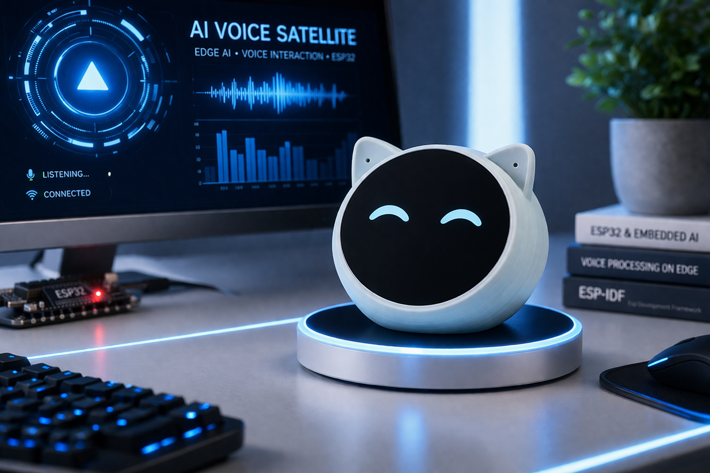
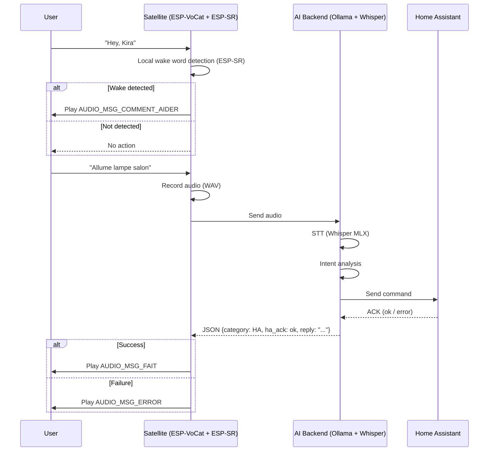

   [](LICENSE) 

# 🤖 ESP-VoCat AI Voice Satellite



---
## 📘 Introduction

The motivation behind this project is to design and build a custom AI-powered voice satellite for a future fully local smart home assistant.

The goal is to create a standalone device that can:
- capture voice commands
- provide audio feedback
- display visual information on a touchscreen
- interact naturally with users in different rooms

This satellite is designed to connect to a local AI backend (running on a Mac with an M1 Pro and 32GB RAM), which handles:
- speech-to-text using Whisper (MLX)
- natural language processing via Ollama
- interaction with Home Assistant for home automation

> ⚠️ The backend setup (Ollama, Whisper MLX, Home Assistant integration) is **not covered in this repository** and will be documented in a separate project.

This repository focuses on:
- the embedded firmware (ESP-IDF)
- hardware choices and integration
- audio capture and playback pipeline
- touchscreen interaction
- communication with the AI backend

---

## 🛠️ Hardware

The current prototype is based on:

- [**ESP-VoCat v1.2**](https://docs.espressif.com/projects/esp-dev-kits/en/latest/esp32s3/esp-vocat/user_guide_v1.2.html)) by Espressif  
  (ESP32-S3 with integrated audio and display capabilities)

This platform provides:
- microphone input (I2S)
- speaker output
- touchscreen interface
- enough compute power for real-time audio streaming

---  

## ✨ Features

- Voice command capture (16kHz WAV)
- AI-based intent recognition (via backend)
- Home Assistant integration
- Audio feedback system
- Touchscreen UI (wake, interaction)

---

## 🗺️ Roadmap

- [x] Audio capture and streaming
- [x] Backend integration (Whisper + Ollama)
- [x] Basic HA control
- [x] Touch wakeup
- [x] Local wake word (ESP-SR or custom)
- [ ] Multi-room synchronization
- [ ] Improved UI/UX

---

## 📂 Project Structure

This project is designed for a French-speaking environment.

To improve responsiveness and avoid unnecessary latency, the satellite does not rely on real-time text-to-speech for basic interactions. Instead, it uses pre-recorded French audio messages.

### Audio Assets

Pre-recorded voice messages are stored in:

**data/msg** 

These audio files are used for:
- wake responses (e.g. "Oui ?")
- confirmations (e.g. "C'est fait")
- error feedback

This approach ensures:
- faster response time
- consistent voice quality
- reduced backend load

A total of 15 predefined French audio messages are available, indexed from 1 to 15.

These files are declared in the *kFiles* array in *audio_player.c* and mapped to numeric IDs for easy playback control.

For convenience, some commonly used messages are also exposed as macros in *audio_player.h*, for example:

- AUDIO_MSG_COMMENT_AIDER → help prompt
- AUDIO_MSG_FAIT → action completed
- AUDIO_MSG_OUI → confirmation
- AUDIO_MSG_ERROR → error feedback

This ID-based system allows lightweight triggering of audio responses without relying on dynamic text-to-speech.

> These audio messages were pre-recorded using [ElevenLabs.io](https://elevenlabs.io/app/voice-library?voiceId=or4EV8aZq78KWcXw48wd) to ensure high-quality and natural-sounding voice output.


## 🖼️ Visual Assets

The avatar images (Kira) are converted into binary format and stored in:

**data/** 

These assets are used to render the on-screen interface efficiently on the ESP32.

### Notes

- The project is optimized for low-latency interaction.
- Most user feedback is handled locally on the device.
- The backend is only used for speech recognition and intent processing.


---
## 🔁 Interaction Flow



---

## 💻 Installation ESP-IDF (macOS)

```bash
xcode-select --install

mkdir -p ~/esp
cd ~/esp
git clone --recursive https://github.com/espressif/esp-idf.git
cd esp-idf
git fetch --tags
git checkout v5.4.1
git submodule update --init --recursive
./install.sh esp32s3
. ./export.sh

idf.py --version
ESP-IDF v5.4.1
```

**🏗️ Project creation + adding the Components**

```bash

idf.py ESP-MYHOME-ECHOEAR
cd ESP-MYHOME-ECHOEAR
idf.py set-target esp32s3

idf.py add-dependency "espressif/minimp3"
idf.py add-dependency "espressif/esp_lcd_st77916"
idf.py add-dependency "espressif/esp_jpeg"
idf.py add-dependency "espressif/esp_lcd_touch_cst816s"
idf.py add-dependency "espressif/esp-sr"
  
idf.py reconfigure

```


---

## 🧠 Wake Word Detection (ESP-SR)

This project uses the ESP-SR component to enable local wake word detection (e.g. “Hey, Kira”) directly on the ESP32-S3.

📦 Model Partition

ESP-SR requires a dedicated flash partition to store its speech recognition models.

You must define a partition named model in your partition table:

```csv
# Name,    Type, SubType,  Offset,    Size,
nvs,       data, nvs,      0x9000,    0x6000,
phy_init,  data, phy,      0xf000,    0x1000,
factory,   app,  factory,  0x10000,   0x400000,
spiffs,    data, spiffs,   0x410000,  0x100000,
model,     data, 0x06,     0x510000,  0xAF0000,

```

**⚙️ How It Works**
- The partition name must be exactly model
- ESP-SR automatically detects this partition at runtime
- On first boot:
- the partition is formatted
- speech models are generated and stored inside

👉 No manual flashing of model files is required

⚠️ Important Notes
- Do not use this partition for other data
- Ensure enough space is allocated (models can be large)
- The partition subtype 0x06 is required for ESP-SR


The wake word model used is *wn9_heykira_tts3*, configured to detect the phrase *“Hey, Kira”*.
The model name is defined in *wake_local.h*.

---

## ⚙️ Project Configuration

Before building the project, you must configure your environment by creating two files: secret.h and config.h.

**🔐 1. Secrets configuration**

Rename the file:

```bash
secret-example.h → secret.h

```

Then edit secret.h and replace all placeholder values with your own credentials:

```c
#pragma once

#define SECRET_WIFI_SSID         "YOUR_WIFI_SSID"
#define SECRET_WIFI_PASSWORD     "YOUR_WIFI_PASSWORD"

#define SECRET_HA_TOKEN          "YOUR_HA_TOKEN"
#define SECRET_API_TOKEN         "YOUR_API_TOKEN"
#define SECRET_WHISPER_TOKEN     "YOUR_WHISPER_TOKEN"
#define SECRET_ELEVENLABS_KEY    "YOUR_ELEVENLABS_KEY"

```

**🛠️ 2. Main configuration**

```bash
config-example.h → config.h

```
Then update the configuration according to your setup:
- Set your network configuration (Wi-Fi, static IP if enabled)
- Configure your Home Assistant instance (HA_URL)
- Provide your backend endpoints (Whisper / TTS)
- Enable or disable features such as authentication or ElevenLabs

Example:

```c
#define WIFI_SSID           SECRET_WIFI_SSID
#define WIFI_PASSWORD       SECRET_WIFI_PASSWORD
#define WIFI_USE_STATIC_IP  1
#define WIFI_IP             "X.X.X.X"

#define HA_URL              "http://X.X.X.X:8123"
#define WHISPER_URL         "http://X.X.X.X:XXXX/transcribe"
#define TTS_URL             "http://X.X.X.X:XXXX/tts"

```

⚠️ Important
- Never commit secret.h to version control
- Keep your API keys and tokens private
- Ensure all endpoints are reachable from the ESP32

---


## 👩 KIRA Avatar Display (ESP32-S3)

### 👁️ Overview

This project implements a lightweight animated avatar system for an ESP32-S3-based voice satellite.

The avatar, named KIRA, is displayed on a 360 × 360 pixel LCD screen and reacts dynamically during audio playback by animating the mouth.

The goal is to achieve a realistic visual interaction while keeping the system simple, fast, and reliable on embedded hardware.

### 🎭 Avatar Design

•	Base image: 360 × 360 JPEG
•	Optimized to perfectly match the display resolution
•	Always rendered as a static background

To create natural mouth movements:
	1.	The base image was processed using generative AI tools
	2.	Multiple mouth variations were created (speaking, small opening, smile, etc.)
	3.	Each variation was manually refined and aligned to ensure visual consistency

Each mouth variation was manually isolated and exported on a green background (chroma key). This technique ensures accurate background removal and minimizes visual artifacts when compositing the mouth onto the original face.

### 🗣️ Animation Approach

Instead of using video or GIF playback, the system uses a patch-based animation technique:
	•	A fixed region of the face (mouth area) is defined
	•	A set of precomputed mouth frames is stored in memory
	•	During audio playback:
	•	The mouth region is updated in real time
	•	Frames are selected based on audio amplitude

This approach ensures:
	•	Low CPU usage
	•	Minimal memory overhead
	•	High responsiveness

### 🛠️ Asset Processing Pipeline

The asset generation process is handled by Python scripts located in the `scripts/` directory:

- **`convert_kira_color.py`**  
  Composites each mouth variation onto the base face image using chroma key removal.  
  Outputs are saved as PNG files in the `mouth_comp/` directory.

- **`convert_kira_sprites.py`**  
  Converts the composited PNG images into RGB565 raw buffers compatible with the ESP32.  
  The generated `.raw` files are stored in the `data/` directory and loaded at runtime.

  1.	The base face (**`kira_face_360.jpg`**  ) is decoded into RGB565 format
	2.	A mouth background patch (bg_mouth.raw) is used for the neutral state
	3.	Several mouth frames are loaded:
	•	mouth_1_small.raw
	•	mouth_2_medium.raw
	•	mouth_3_smile.raw
	•	mouth_4_small2.raw
	4.	Each frame is stored as RGB565 raw buffers

At runtime:
	•	The mouth background is first restored
	•	A mouth frame is then overlaid depending on the current audio level
	•	The frame buffer is flushed to the display

### 🔊 Audio-Driven Animation

The animation is driven by real-time audio playback:
	•	Audio amplitude is sampled continuously
	•	A smoothing filter is applied to avoid jitter
	•	The amplitude is mapped to discrete mouth states

Example mapping:
	•	Low amplitude → small mouth movement
	•	Medium amplitude → speaking mouth
	•	High amplitude → wider expression (smile/open)

When no audio is playing:
	•	The system displays only the base face (neutral mouth)

### 🚫 Why Not Use GIF or Video?

While GIF or full-frame animation is technically possible, this project intentionally avoids it because:
	•	Higher memory consumption
	•	Increased CPU load
	•	Less flexibility for real-time interaction
	•	Harder synchronization with audio

The patch-based approach provides a better balance between:
	•	Visual quality
	•	Performance
	•	System stability

### ⭐ Key Benefits
• Optimized for ESP32-S3 (PSRAM + SPI Flash)
•	Real-time responsive animation
•	Low resource usage
•	Fully local (no cloud dependency)
•	Easy to extend with new expressions

---

## 🌐 HTTP API Reference

The satellite exposes a lightweight HTTP server (port **80**) that lets you control audio playback, TTS, face animation, and trigger a wake event.

All endpoints use **GET** requests. No request body is required.

---

### 🔐 Authentication

When `ENABLE_AUTH` is set to `1` in `config.h`, every request must include a valid API token. Two methods are accepted:

| Method | Example |
|--------|---------|
| Header `X-API-Token` | `X-API-Token: mytoken` |
| Query parameter `token` | `?token=mytoken` |

If the token is missing or incorrect the server returns `401`:
```json
{"ok": false, "error": "unauthorized"}
```

> `/status` does **not** require authentication.

---

### 📍 Endpoints

#### `GET /play`

Play a pre-recorded audio file stored in SPIFFS (`/spiffs/msg/`).

**Query parameters**

| Parameter | Required | Description |
|-----------|----------|-------------|
| `id` | yes (if not in path) | File index, integer between `1` and `13` |
| `vol` | no | Playback volume, float `0.0`–`1.0` |

**Alternative path form:** `GET /play/<id>?vol=<v>`

**Examples**
```
GET /play?id=3
GET /play?id=5&vol=0.8
GET /play/7
GET /play/7?vol=0.5
```

**Success response**
```json
{"ok": true, "queued": 3, "volume": 0.80}
```

**Error responses**
```json
{"ok": false, "error": "id must be between 1 and 13"}
{"ok": false, "error": "playback failed"}
```

---

#### `GET /playtxt`

Convert text to speech using **ElevenLabs** and play the resulting audio.

> Requires `ENABLE_ELEVENLABS 1` in `config.h`. Returns `400` if disabled.

**Query parameters**

| Parameter | Required | Description |
|-----------|----------|-------------|
| `txt` | yes | URL-encoded text to speak |
| `vol` | no | Playback volume, float `0.0`–`1.0` |

**Example**
```
GET /playtxt?txt=Hello%20world&vol=0.7
```

**Success response**
```json
{"ok": true, "playing": true, "bytes": 24576, "volume": 0.70}
```

**Error responses**
```json
{"ok": false, "error": "ElevenLabs disabled"}
{"ok": false, "error": "missing txt parameter"}
{"ok": false, "error": "ElevenLabs HTTP 401"}
{"ok": false, "error": "PSRAM alloc failed"}
{"ok": false, "error": "TTS download too small"}
{"ok": false, "error": "playback failed"}
```

---

#### `GET /volume`

Set the playback volume.

**Query parameters**

| Parameter | Required | Description |
|-----------|----------|-------------|
| `level` | yes | Volume level, float `0.0`–`1.0` |

**Example**
```
GET /volume?level=0.6
```

**Success response**
```json
{"ok": true, "volume": 0.60}
```

---

#### `GET /stop`

Stop the current audio playback immediately.

**Example**
```
GET /stop
```

**Success response**
```json
{"ok": true}
```

---

#### `GET /status`

Return the current playback state. **No authentication required.**

**Example**
```
GET /status
```

**Success response**
```json
{
  "ok": true,
  "playing": false,
  "volume": 0.70,
  "file": "msg/3.mp3",
  "error": ""
}
```

---

#### `GET /list`

List all audio files available in `/spiffs/msg/`.

**Example**
```
GET /list
```

**Success response**
```json
{"ok": true, "files": ["/msg/1.mp3", "/msg/2.mp3", "/msg/3.mp3"]}
```

---

#### `GET /face/get`

Get the current eye/face animation position.

**Example**
```
GET /face/get
```

**Success response**
```json
{"x": 112, "y": 145}
```

---

#### `GET /face/set`

Set the eye/face animation position.

**Query parameters**

| Parameter | Required | Description |
|-----------|----------|-------------|
| `x` | no | Horizontal position (pixels) |
| `y` | no | Vertical position (pixels) |

Omitted parameters keep their current value.

**Example**
```
GET /face/set?x=112&y=145
```

**Success response**
```json
{"ok": true, "x": 112, "y": 145}
```

---

#### `GET /wake`

Trigger a software wake event, equivalent to a physical touch wake. Useful for automating a wake-word activation from an external system (e.g. Home Assistant).

**Example**
```
GET /wake
```

**Success response**
```
OK
```

---

### ❌ Error format

All JSON error responses share the same structure:

```json
{"ok": false, "error": "<description>"}
```

| HTTP Status | Meaning |
|-------------|---------|
| `200` | Success |
| `400` | Bad request (missing or invalid parameter) |
| `401` | Unauthorized (invalid or missing token) |
| `404` | Unknown route |
| `500` | Internal error (playback failure, allocation error, …) |

---

### 📋 Quick reference

| Method | Endpoint | Auth | Description |
|--------|----------|------|-------------|
| GET | `/play?id=N[&vol=V]` | yes | Play pre-recorded file N (1–13) |
| GET | `/play/<N>[?vol=V]` | yes | Same, path form |
| GET | `/playtxt?txt=...&vol=V` | yes | TTS via ElevenLabs |
| GET | `/volume?level=V` | yes | Set volume (0.0–1.0) |
| GET | `/stop` | yes | Stop playback |
| GET | `/status` | no | Playback status |
| GET | `/list` | yes | List audio files |
| GET | `/face/get` | yes | Get face position |
| GET | `/face/set?x=X&y=Y` | yes | Set face position |
| GET | `/wake` | yes | Trigger wake event |


---

## 🚀 Conclusion

ESP-VoCat is an evolving project aimed at building a fully local AI voice satellite.

The `main` branch reflects a stable and usable version of the system.  
New features and improvements are continuously developed and integrated over time.

Feel free to follow the project for upcoming updates.

---

## 📚 References

- [ESP-VoCat v1.2](https://docs.espressif.com/projects/esp-dev-kits/en/latest/esp32s3/esp-vocat/user_guide_v1.2.html)
- [User Guide for Built-in Firmware](https://espressif.craft.me/CI2XAhb4Ix7fZk)
- [Examples:](https://github.com/espressif/esp-brookesia/tree/master/products/speaker)
- [ElevenLabs.io](https://elevenlabs.io/app/voice-library?voiceId=or4EV8aZq78KWcXw48wd)
-  [ESP-SR](https://github.com/espressif/esp-sr)
